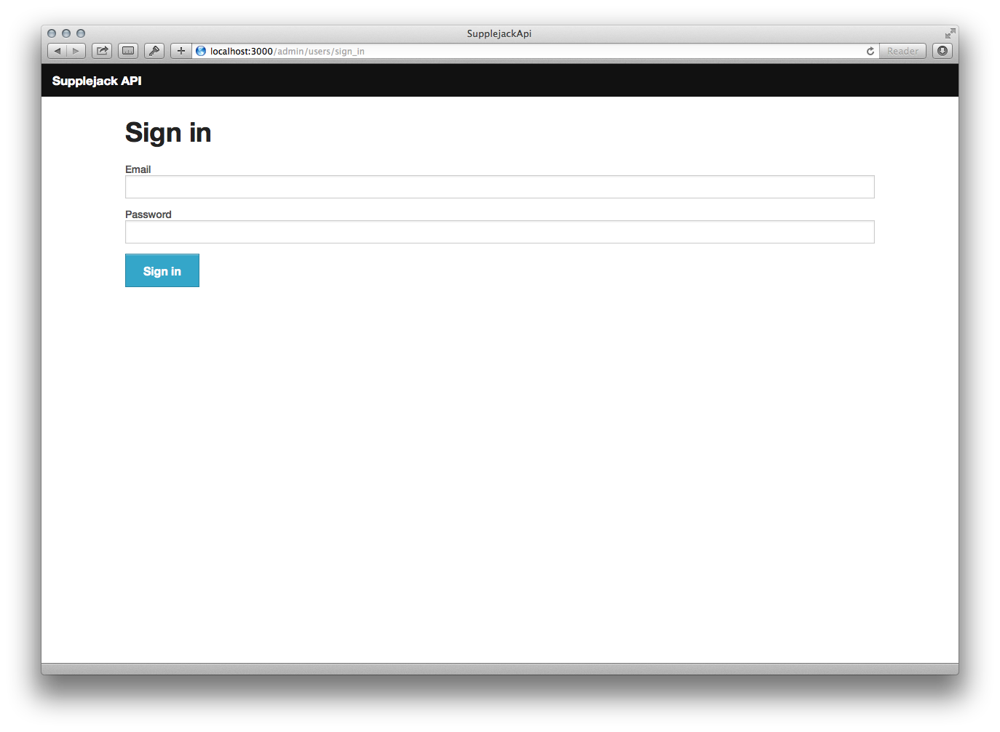

Supplejack API comes with an admin page that lets you do the following:

* Track users activities.
* Track API usage by date.
* Update users' Max Requests value.
* Export data to CSV.

## Accessing API Admin

After running your Supplejack API instance, visit `localhost:3000/admin/users/sign_in`. If you build your API instance using [installation template](https://github.com/DigitalNZ/supplejack_installation), you'll be given a default admin user with the following credentials:

* `email: test@example.com`
* `password: supplejack`

Otherwise, you can create your own user by accessing the console.

```bash
  > SupplejackApi::User.create(email: 'your@email.com', name: 'Your name', username: 'yourusername', role: 'admin', password: 'supplejack', password_confirmation: 'supplejack')
end
```



