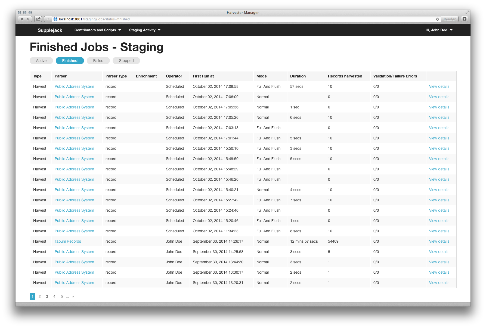

All harvest and enrichment jobs can be found at the job status page. From the header, hover over the "Staging" or "Production" activity dropdown menu. Select "Active/Finished/Failed/Stopped" jobs menu.

### Filter by parser
You can filter each job status by parser by passing `parser` parameter in the URL.

Example:

Find all jobs with `finished` status with `5428a8225311635ede000007` parser.
`http://localhost:3001/staging/jobs?parser=5428a8225311635ede000007&status=finished`

Find all jobs with `failed` status with `5428a8225311635ede000007` parser.
`http://localhost:3001/staging/jobs?parser=5428a8225311635ede000007&status=failed`