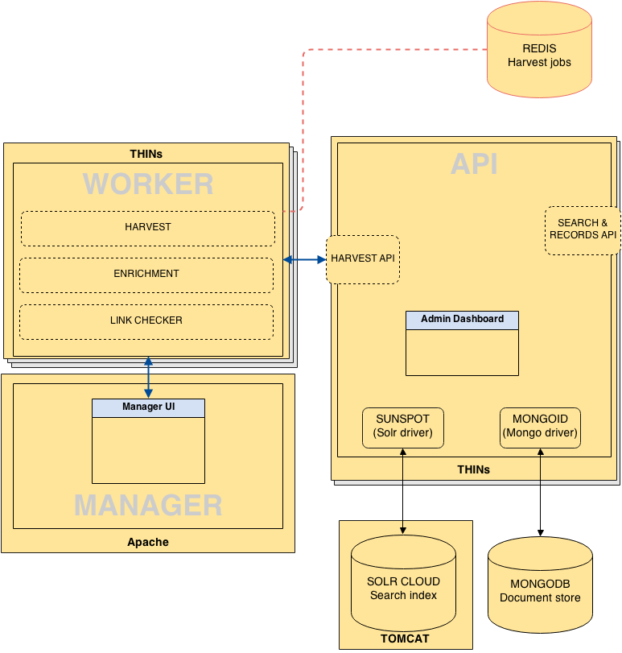

# What is Supplejack?

Supplejack is a platform for managing the harvesting and manipulation of metadata. It was originally developed to manage the sourcing of metadata for the [DigitalNZ](http://www.digitalnz.org/) aggregation service, and has grown to a platform that can manage millions of records from hundreds of data sources.

It's main purpose is to manage the process of fetching data from remote sources, mappaing data to a standard data schema, managing any quality control or enrichment processes, and surfacing the standardised data via a public API. The full [Supplejack code repo](https://github.com/DigitalNZ) is on GitHub. 

Check out the screencast for an introduction to Supplejack:

<iframe width="480" height="360" src="//www.youtube.com/embed/MLUURxcfcLc?rel=0" frameborder="0" allowfullscreen></iframe>

### Key features

* Responsive designed web interface for managing harvesting activity
* Support for all types of data sources, including XML, OAI-PMH, RSS, HTML, MARC, RDF, JSON
* Customisable [data schema](http://digitalnz.github.io/supplejack/api/creating-a-schema.html)
* A rich [Domain Specific Language](http://digitalnz.github.io/supplejack/manager/introduction-to-parser-scripts.html) for writing the harvest instructions for each data source
* Ability to embed ruby code into parser scripts for complex data harvests or enrichments
* Inbuilt error-checking, and notification routines during the harvesting and enrichment processes
* Code snippets that can be used to insert parser scripting blocks for reuse across different harvests
* Support for [manipulation](http://digitalnz.github.io/supplejack/manager/modifiers.html), [validation](http://digitalnz.github.io/supplejack/manager/validations.html), [namespacing](http://digitalnz.github.io/supplejack/manager/xml-namespaces.html), [transformation](http://digitalnz.github.io/supplejack/manager/attribute-transformation-options.html), and [enrichment](http://digitalnz.github.io/supplejack/manager/enrichments.html) of data
* Scheduling options for regular reharvests and incremental updates and deletions. Can be set to any increment such as every hour, day, month etc. at a specific time
* Throttling and response time control to specifiy rate at which individual harvests run
* Broken link monitoring with automatic search index suppression and restoration routines
* Manual control for the suppression of records or collections from the search index
* API framework for the sharing of stadardised data

### Architecture

Developed in Ruby on Rails, there are three core components of the Supplejack platform:

* [Manager](http://digitalnz.github.io/supplejack/start/supplejack-manager.html) (user interface for controlling activity)
* [Worker](http://digitalnz.github.io/supplejack/start/supplejack-worker.html) (for harvesting, enrichment, and link checking activity)
* [API](http://digitalnz.github.io/supplejack/start/supplejack-api.html) (public API wrapper to search index and metadata repository)

Supplejack relies on integration with both a search index (default is Solr) and a metadata repository (default is MongoDB).

 

